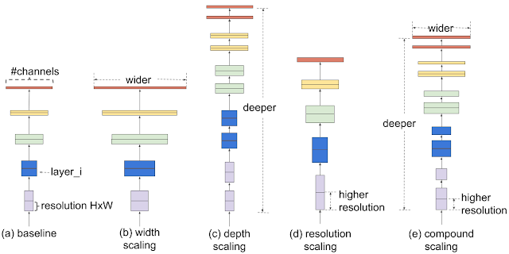

# bird_calls_thunder_struck_duck

## Using Deep learning to Predict Sounds Files

## Team name: Thunderstruck Duck

## Individuals: Andy Kwon, Hyun Soo Kim, Peter Smith, Claudia Flores

## Proposal: Bird sound recognition using Machine Learning

The purpose of this project is to predict in accuracy the types of birds based on the calls they make. Sound files, if expressed in terms of time and amplitude, can be transformed into an image. This allows for Deep Learning models to be used to analyze and predict sound files.

A compiled dataset of 91 different bird species and 2730 sound files are available through Kaggle. The sound files originate from xeno-canto.com:
* https://www.kaggle.com/samhiatt/xenocanto-avian-vocalizations-canv-usa

## Modeling:
Efficientnet, developed by Google, will be used to train the model. Efficientnet differ from other image classifying models like Xception and AmoebaNet because it uniformly scales dimensions of the layers, instead of arbitrarily scaling them. More detailed information is available through:
* https://ai.googleblog.com/2019/05/efficientnet-improving-accuracy-and.html
Much credit goes to Francois Lemarchand for development. We worked around fitting our dataset into this model:
* https://www.kaggle.com/frlemarchand/bird-song-classification-using-an-efficientnet

## Website:
We created a website where users can dynamically upload their bird sound files and returns the user with the prediction:
https://bird-call.herokuapp.com/#

## Data Upload and storage:
Both train and test data are available through s3 bucket or the above Kaggle link. For uploading and downloading the audio file for modeling, we also used s3 and Boto3 for the entire process

![] (Flowchart.png)
## Libraries and programs used:

*Audacity (For audio processing)
*Boto3
*FFMPEG
*Flask
*Flask
*Gunicorn
*HTML/CSS/JS
*JavaScript D3 (potentially)
*Jinja2
*Machine learning libraries 
*TensorFlow
*Sklearn
*Pandas
*PIL
*Pillow
*Pydub
*Pymongo
*Python pandas
*Scipy
*Seaborn
*Tqdm
*Uuid
*Wave
*Werkzeug
